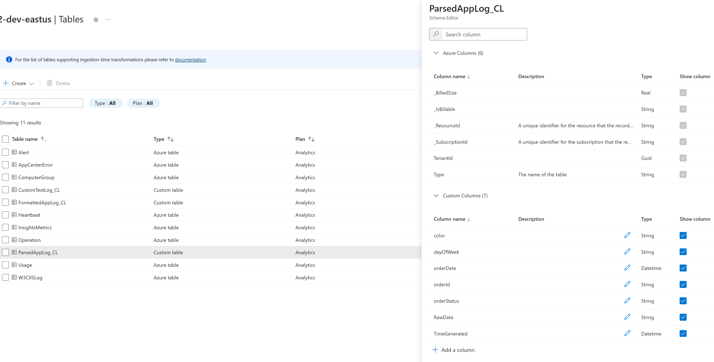
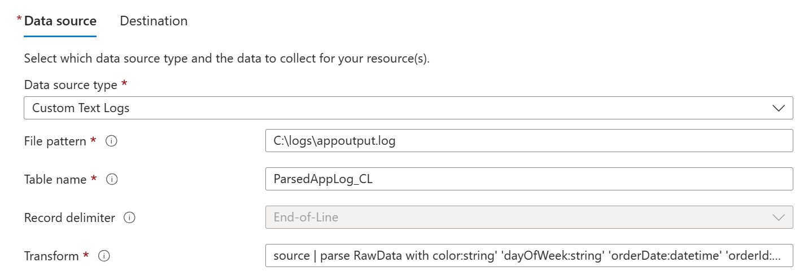
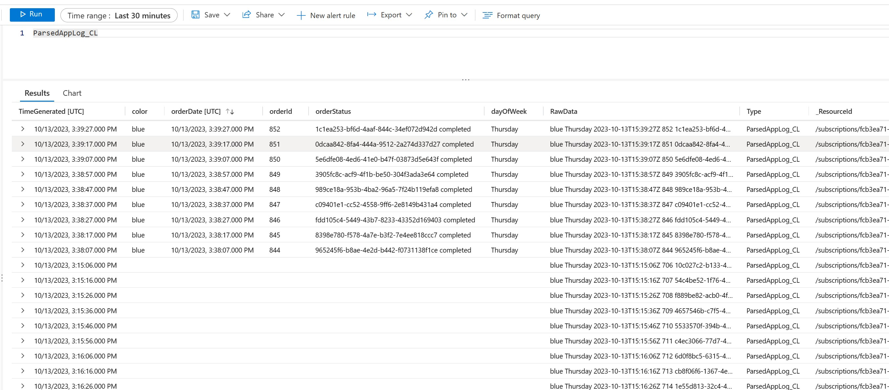

# Azure Monitor Custom Log Ingestion How-to

In addition to Windows event logs, IIS logs and Linux syslog, custom text logs can be ingested into Azure Monitor.  This enables users to query the logs with KQL (Kusto Query Language) to view useful insights, generate charts and alerts.  There are some caveats, however.  The logs must be:

* Text-based (ASCII or UTF-8 encoded).
* Non-wrapping.  New logs should be generated in a new file with a different name.
* Records must be separated with an end-of-line.
* Logs should reside on a local file system, not a network-attached share.

## Confirm Host and Log Details

For this how-to, we will ingest a log that resides on a Windows virtual machine using the Azure Monitor Agent, which should be present and running on the server.  Custom text log ingestion is supported on Linux VMs as well.  Ensure the agent is running the latest version.

Next, identify the process that will be generating the text log file and location.  For testing, we are using a PowerShell script called [log-generator.ps1](./log-generator.ps1) which generates a sample log file called appoutput.log in C:\logs.

## Build the Log Analytics Workspace & Custom Log Table

If a workspace isn't already present, you can use the sample [logAnalyticsWorkspace.bicep](./logAnalyticsWorkspace.bicep) template to create one.

Custom text logs will need to be ingested to a custom log table in the Log Analytics workspace.  The table can be created with the Azure REST API commands below in Azure Cloud Shell or a script.  Replace "CustomLogTableName", "subscription", "resourcegroup" and "LogAnalyticsWorkspaceName" with values that reflect your environment.  The Custom Log name **must** be appended with a 'CL'.  **TimeGenerated** and **RawData columns must be present**. but you can add other columns to meet your business needs.  Common data types for the columns are string, boolean, int and long.

```powershell
# Define an your Custom Table object
#
$tableParams = @'
{
  "properties": {
     "schema": {
       "name": "{CustomLogTableName}_CL",
       "columns": [
         { 
           "name": "TimeGenerated",
           "type": "DateTime"            
         },
         {
            "name": "RawData",
            "type": "string"
         },
         {
           "name": "color",
           "type": "string"
         },
         {
           "name": "day",
           "type": "string"
         },
         {
           "name": "orderDate",
           "type": "DateTime"
         },
         {
           "name": "orderId",
           "type": "string"
         },
         {
           "name": "orderStatus",
           "type": "string"
         }
       ]
     }
   }
 }
'@
# Use the tableParams object in the PowerShell command below to create your table.
#
Invoke-AzRestMethod -Path "/subscriptions/{subscription}/resourcegroups/{resourcegroup}/providers/microsoft.operationalinsights/workspaces/{LogAnalyticsWorkspaceName}/tables/{CustomLogTableName}_CL?api-version=2021-12-01-preview" -Method PUT -payload $tableParams
```

If the response is '200', the command ran successfully.  You can navigate to your Log Analytics workspace in the Azure Portal, select the Tables blade in the left pane to ensure your table is present:  Azure Portal -> search for LogAnalytics Workspace name -> select Tables in left pane -> find your custom table -> right-click -> Edit Schema



##  Create the Data Collection Rule

The source has been identified, the destination table has been configured, now you will need to create a Data Collection Rule to ingest that data into your Log Analytics workspace.  You can create the Data Collection Rule via portal or programmatically (sample Bicep script is [here](./customDataCollectionRule.bicep)).  A data collection rule consists of several parts: 

1. The Data Collection Endpoint which is a requirement for custom log ingestion.  A data collection endpoint can be created in the Azure Portal or programmatically, see sample Bicep script called [dataCollectionEndpoint.bicep](./dataCollectionEndpoint.bicep).  Multiple data collection rules may be associated to a single data collection endpoint.
2. One or more resources to collect the data from.  Here you can specify the VM generating the custom log.
3. A data source which defines the log to be ingested, its type and an optional "transform" setting (more on that below).  For the example here, the data source type is "Custom Text Logs", the path to the custom log on the remote server is C:\logs\appoutput.log, the custom table name is ParsedAppLog_CL and a transform directive.
4. The destination for the data collection rule.  This would be "Azure Monitor Logs" and the Log Analytics Workspace that contains your custom table.

In the data source area, there is a transform option allows you to manipulate the custom log data using a Kusto query before reaching the target Log Analytics table.  To leverage this, you'll add a pipe '|' after "source" and include a KQL query that manipulates the data as needed  In the example here, we are taking the string in the RawData field and splitting it into distinct data types to match the columns of our custom table.

In an ordinary KQL query, you would use your custom table as the source and run a command like this to separate the data in the RawData area:

```javascript
CustomTextLog_CL |
parse RawData with
Date:datetime' '
Record:string' '
Status:string' '
id:string
```

Using the transform option in the Data Collection Rule data source, you can accomplish the same with this command at ingestion time:

```source | parse RawData with color:string' 'dayOfWeek:string' 'orderDate:datetime' 'orderId:string' 'orderStatus:string```




Once this rule has been created, the data should appear via a Kusto query of the target table within 5 minutes of sending.

The transform setting can be tuned if required.  Note the resulting data formatting may change in your table if the rule is changed during ingestion.

